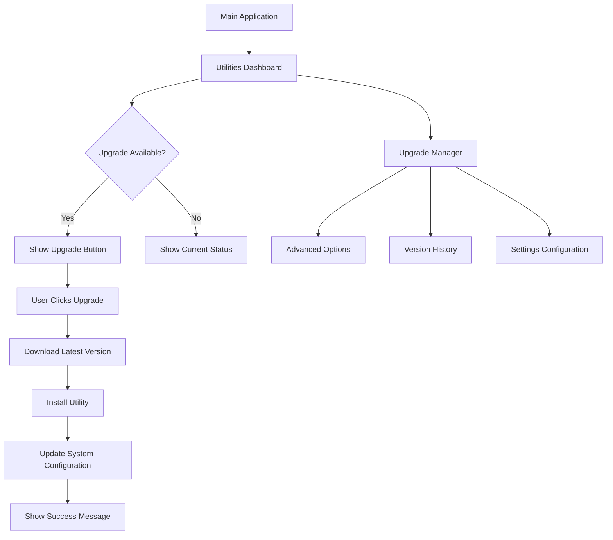

## 1. Product Overview
A comprehensive upgrade management system for FFmpeg and yt-dlp utilities that provides automatic version checking, downloading, and installation capabilities. This system will help users easily keep their media conversion utilities up-to-date with minimal manual intervention.

The system addresses the problem of outdated utilities that may cause compatibility issues with YouTube downloads and media conversion operations. Users will benefit from a centralized interface to manage and upgrade their essential media processing tools.

## 2. Core Features

### 2.1 User Roles
| Role | Registration Method | Core Permissions |
|------|---------------------|------------------|
| Standard User | Application user | View utility status, initiate upgrades, configure settings |
| System Admin | Windows administrator | Install utilities system-wide, configure global settings |

### 2.2 Feature Module
Our utility upgrade system consists of the following main pages:
1. **Utilities Dashboard**: Shows current versions, upgrade status, and quick actions for FFmpeg and yt-dlp.
2. **Upgrade Manager**: Provides detailed upgrade options, version history, and advanced settings.
3. **Settings Configuration**: Allows users to configure download locations, proxy settings, and automatic upgrade preferences.

### 2.3 Page Details
| Page Name | Module Name | Feature description |
|-----------|-------------|---------------------|
| Utilities Dashboard | Status Overview | Display current FFmpeg and yt-dlp versions with upgrade availability indicators. |
| Utilities Dashboard | Quick Actions | Provide one-click upgrade buttons for each utility with progress feedback. |
| Utilities Dashboard | System Health | Show overall utility health status and last check timestamp. |
| Upgrade Manager | Version Comparison | Compare installed versions with latest available releases from official sources. |
| Upgrade Manager | Download Progress | Show real-time download progress with pause/resume capabilities. |
| Upgrade Manager | Installation Control | Manage installation process with rollback options on failure. |
| Settings Configuration | Download Preferences | Configure download locations and bandwidth limitations. |
| Settings Configuration | Proxy Settings | Set up proxy configurations for network-restricted environments. |
| Settings Configuration | Auto-Upgrade Options | Enable/disable automatic upgrade checks and installations. |

## 3. Core Process
**Standard User Flow:**
1. User opens Utilities Dashboard from main application menu
2. System automatically checks current utility versions against latest releases
3. Dashboard displays upgrade availability with clear visual indicators
4. User clicks "Upgrade" button next to outdated utility
5. System downloads latest version with progress feedback
6. Installation proceeds automatically with safety checks
7. Success confirmation displayed with version information updated

**Advanced User Flow:**
1. User navigates to Upgrade Manager for detailed control
2. Reviews version comparison table with release notes
3. Selects specific version or latest stable release
4. Configures download preferences and proxy settings if needed
5. Initiates upgrade with custom options
6. Monitors detailed progress with technical information
7. Accesses rollback options if installation encounters issues

## 4. User Interface Design

### 4.1 Design Style
- **Primary Colors**: Deep blue (#2B6CB0) for primary actions, sky blue (#87CEEB) for secondary elements
- **Secondary Colors**: Green (#38A169) for success states, orange (#DD6B20) for warnings, red (#E53E3E) for errors
- **Button Style**: Modern rounded corners (12px radius), gradient backgrounds, hover effects with opacity changes
- **Font**: System default fonts with clear hierarchy - 16px for headers, 14px for body text, 12px for secondary information
- **Layout Style**: Card-based layout with subtle shadows, clear visual separation between utility sections
- **Icons**: Use emoji and system icons for quick visual recognition of utility types and status

### 4.2 Page Design Overview
| Page Name | Module Name | UI Elements |
|-----------|-------------|-------------|
| Utilities Dashboard | Status Overview | Card-based layout with utility icons, version badges in colored chips, upgrade buttons with progress indicators, last check timestamp in subtle gray text. |
| Utilities Dashboard | Quick Actions | Large prominent upgrade buttons with animated progress bars, cancel buttons for ongoing operations, detailed status messages below each utility card. |
| Upgrade Manager | Version Comparison | Table layout with current vs latest version rows, release notes expandable sections, download size and date information in metadata format. |
| Settings Configuration | Download Preferences | Form inputs with validation, folder picker dialogs for download paths, numeric inputs for bandwidth limits with unit selectors. |

### 4.3 Responsiveness
Desktop-first design approach with responsive considerations for different window sizes. The interface will adapt gracefully when resized, maintaining usability across various screen resolutions commonly used for media conversion applications.