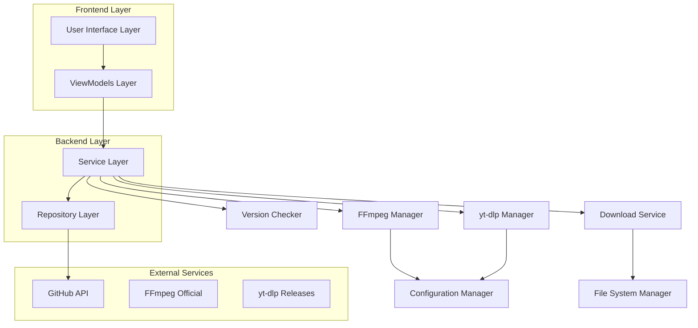
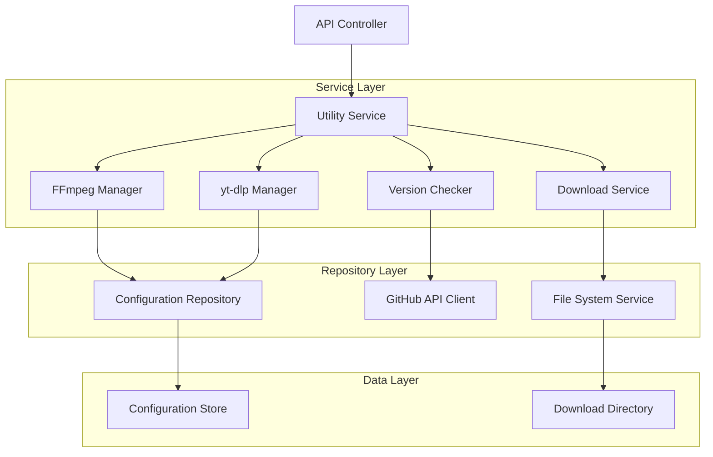

## 1. Architecture Design



## 2. Technology Description
- **Frontend**: Avalonia UI with MVVM pattern, ReactiveUI for reactive programming
- **Backend**: .NET 8 with C#, dependency injection via Microsoft.Extensions.DependencyInjection
- **HTTP Client**: System.Net.Http with Polly for retry policies
- **File System**: System.IO with async operations
- **Configuration**: JSON-based configuration with IOptions pattern
- **Logging**: Microsoft.Extensions.Logging with structured logging
- **Testing**: xUnit for unit tests, Moq for mocking, FluentAssertions for assertions

## 3. Route Definitions
| Route | Purpose |
|-------|---------|
| /utilities | Main utilities dashboard showing FFmpeg and yt-dlp status |
| /utilities/upgrade | Detailed upgrade manager with version comparison |
| /utilities/settings | Configuration page for download preferences and proxy settings |
| /utilities/logs | Upgrade history and operation logs |

## 4. API Definitions

### 4.1 Core API

**Utility Status Check**
```
GET /api/utilities/status
```

Response:
```json
{
  "ffmpeg": {
    "isAvailable": true,
    "currentVersion": "6.1.0",
    "latestVersion": "7.0.0",
    "upgradeAvailable": true,
    "path": "C:\\Program Files\\ffmpeg\\bin\\ffmpeg.exe",
    "lastChecked": "2024-01-15T10:30:00Z"
  },
  "ytDlp": {
    "isAvailable": true,
    "currentVersion": "2024.01.15",
    "latestVersion": "2024.01.25",
    "upgradeAvailable": true,
    "path": "C:\\Users\\User\\AppData\\Local\\PilgrimsMediaConverter\\yt-dlp.exe",
    "lastChecked": "2024-01-15T10:30:00Z"
  }
}
```

**Check for Updates**
```
POST /api/utilities/check-updates
```

Request:
```json
{
  "utilities": ["ffmpeg", "ytDlp"],
  "includePrerelease": false
}
```

**Download Utility**
```
POST /api/utilities/download
```

Request:
```json
{
  "utility": "ffmpeg",
  "version": "7.0.0",
  "downloadPath": "C:\\Temp\\Downloads"
}
```

**Install Utility**
```
POST /api/utilities/install
```

Request:
```json
{
  "utility": "ffmpeg",
  "downloadPath": "C:\\Temp\\Downloads",
  "installPath": "C:\\Program Files\\ffmpeg"
}
```

### 4.2 Configuration API

**Get Configuration**
```
GET /api/utilities/configuration
```

**Update Configuration**
```
PUT /api/utilities/configuration
```

Request:
```json
{
  "downloadDirectory": "C:\\Users\\User\\Downloads",
  "maxConcurrentDownloads": 3,
  "bandwidthLimit": 1048576,
  "proxy": {
    "enabled": false,
    "host": "",
    "port": 8080,
    "username": "",
    "password": ""
  },
  "autoCheckForUpdates": true,
  "autoInstallUpdates": false,
  "preferredVersions": {
    "ffmpeg": "stable",
    "ytDlp": "latest"
  }
}
```

## 5. Server Architecture Diagram



## 6. Data Model

### 6.1 Data Model Definition

```mermaid
erDiagram
    UTILITY_STATUS {
        string UtilityName PK
        string CurrentVersion
        string LatestVersion
        boolean IsAvailable
        boolean UpgradeAvailable
        string ExecutablePath
        datetime LastChecked
        string ErrorMessage
    }
    
    UTILITY_CONFIGURATION {
        string Key PK
        string Value
        string Category
        datetime LastModified
    }
    
    UPGRADE_HISTORY {
        int Id PK
        string UtilityName
        string FromVersion
        string ToVersion
        datetime UpgradeDate
        boolean Success
        string ErrorMessage
        string DownloadPath
    }
    
    DOWNLOAD_PROGRESS {
        int Id PK
        string UtilityName
        string Version
        long TotalBytes
        long DownloadedBytes
        int Percentage
        string Status
        datetime StartTime
        datetime? EndTime
    }
```

### 6.2 Data Definition Language

**Utility Status Table**
```sql
CREATE TABLE utility_status (
    utility_name VARCHAR(50) PRIMARY KEY,
    current_version VARCHAR(50),
    latest_version VARCHAR(50),
    is_available BOOLEAN DEFAULT FALSE,
    upgrade_available BOOLEAN DEFAULT FALSE,
    executable_path TEXT,
    last_checked TIMESTAMP WITH TIME ZONE DEFAULT NOW(),
    error_message TEXT
);
```

**Upgrade History Table**
```sql
CREATE TABLE upgrade_history (
    id SERIAL PRIMARY KEY,
    utility_name VARCHAR(50) NOT NULL,
    from_version VARCHAR(50),
    to_version VARCHAR(50),
    upgrade_date TIMESTAMP WITH TIME ZONE DEFAULT NOW(),
    success BOOLEAN DEFAULT FALSE,
    error_message TEXT,
    download_path TEXT
);
```

**Configuration Table**
```sql
CREATE TABLE utility_configuration (
    key VARCHAR(100) PRIMARY KEY,
    value TEXT,
    category VARCHAR(50),
    last_modified TIMESTAMP WITH TIME ZONE DEFAULT NOW()
);

-- Initial configuration data
INSERT INTO utility_configuration (key, value, category) VALUES
('download_directory', '%LOCALAPPDATA%\\PilgrimsMediaConverter\\downloads', 'download'),
('max_concurrent_downloads', '3', 'download'),
('bandwidth_limit', '1048576', 'download'),
('auto_check_for_updates', 'true', 'update'),
('auto_install_updates', 'false', 'update'),
('ffmpeg_preferred_version', 'stable', 'version'),
('yt_dlp_preferred_version', 'latest', 'version');
```

## 7. Service Interfaces

### 7.1 IUtilityManager Interface
```csharp
public interface IUtilityManager
{
    Task<UtilityStatus> GetStatusAsync(string utilityName);
    Task<bool> CheckForUpdatesAsync(string utilityName);
    Task<DownloadResult> DownloadAsync(string utilityName, string version, IProgress<DownloadProgress> progress);
    Task<InstallationResult> InstallAsync(string utilityName, string downloadPath, IProgress<InstallationProgress> progress);
    Task<bool> UninstallAsync(string utilityName);
}
```

### 7.2 IVersionChecker Interface
```csharp
public interface IVersionChecker
{
    Task<VersionInfo> GetLatestVersionAsync(string utilityName, bool includePrerelease = false);
    Task<VersionInfo> GetCurrentVersionAsync(string utilityName);
    Task<bool> IsUpdateAvailableAsync(string utilityName);
}
```

### 7.3 IDownloadService Interface
```csharp
public interface IDownloadService
{
    Task<DownloadResult> DownloadFileAsync(string url, string destinationPath, IProgress<DownloadProgress> progress);
    Task<bool> ExtractArchiveAsync(string archivePath, string destinationPath);
    Task<bool> VerifyChecksumAsync(string filePath, string expectedChecksum);
}
```

## 8. Error Handling Strategy

### 8.1 Exception Types
- `UtilityNotFoundException`: When utility executable is not found
- `DownloadFailedException`: When download operation fails
- `InstallationFailedException`: When installation process fails
- `VersionCheckFailedException`: When version checking fails
- `ConfigurationException`: When configuration is invalid

### 8.2 Error Recovery
- Automatic retry with exponential backoff for network operations
- Fallback to alternative download sources
- Rollback mechanism for failed installations
- Graceful degradation when utilities are unavailable
- User-friendly error messages with actionable solutions

## 9. Security Considerations

### 9.1 Download Security
- Verify digital signatures of downloaded utilities
- Check file checksums against official sources
- Use HTTPS for all download operations
- Implement certificate pinning for critical downloads

### 9.2 Installation Security
- Validate file integrity before installation
- Run security scans on downloaded files
- Implement sandboxed installation process
- Require user consent for system-wide installations

### 9.3 Configuration Security
- Encrypt sensitive configuration data
- Validate all user inputs
- Implement proper access controls
- Audit configuration changes